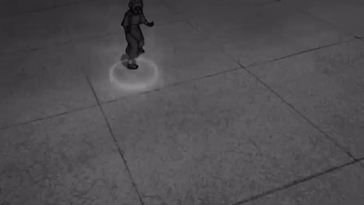

# TOPH

Accesible plotting library that implements heuristic sonification methods to provide first-class accesibility features
for low vision and blind individuals.


## Team Members

- Yu-Sheng (Chris) Chen
- Muhammed Ersoy
- Tejashri Kelhe
- Rithvik Srinivasaiya
- Marcus Kadam

## Usage

```python
import toph.plots as plt

if __name__ == "__main__":

    x = [0,1,2,3]
    y = [10,20,40,20]

    bar = plt.bar(x,y)

    bar.play()
```
## Installation


### GNU Linux

To use the most recent python versions (> 3.6), you may need to build pyaudio from [source](https://github.com/CristiFati/pyaudio.git)
as the pre-built wheels are not available in package archives.

Just clone and cd into the repository and run;

```sh
pip install .
```
