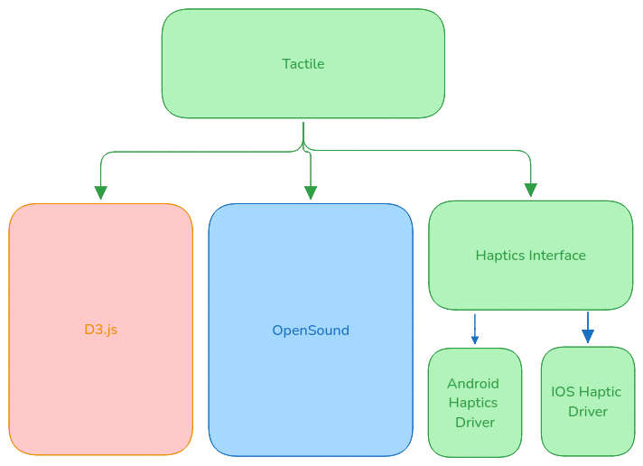
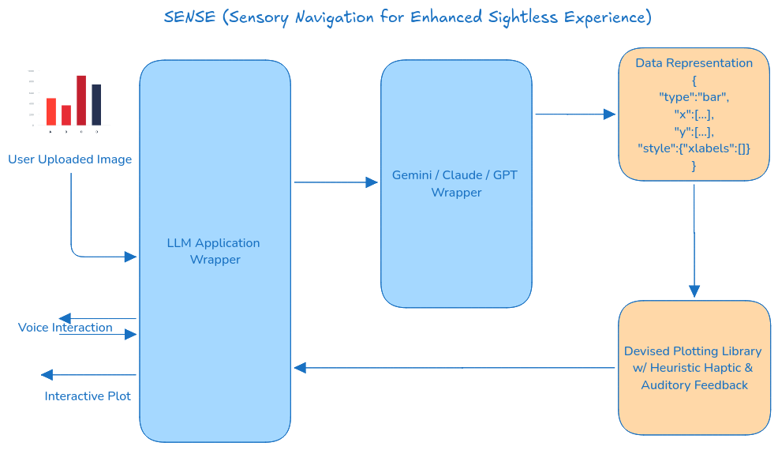

# Multimodal Native Framework

## Background

- There are a number of frameworks that aid in creating interactive visualizations for the web, from higher level
libraries such as plotly and altair to lower level alternatives such as `D3.js`. Currently none of these solutions support a suite of 
accesibility options out of the box.

### Impact 

- There are 250 million + people with severe vision impairment according to who. Visualizations without accesibility
options limit their ability to interact with the world of data.

### Goal

- Create an inclusive library that integrates tested solutions into its API. 
- Implement a Gemini API Wrapper that can explain and answer questions about visulizations.

## Pseudo-code

This haptic & audio visualization library could either be standalone with a familiar API;
```python
tactile.bar(
            x=np.arange(0, 10),
            y=np.arange(0, 10) ** 2,
            haptics=tactile.bar,
            audio=tactile.pitch(np.arange(0,10) ** 2)
            )
```

or it could be implemented as an extension to existing solutions (Altair, plotly etc...)

## Diagrams



- LLM Powered idea



